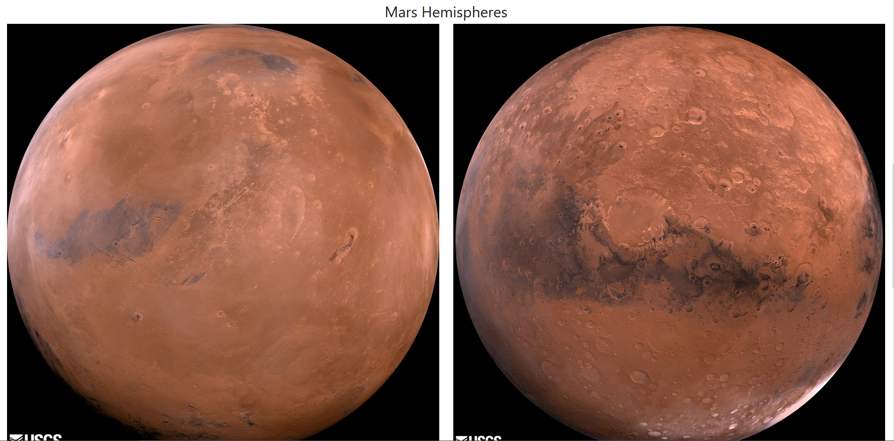

# Mission To Mars (Deprecated)
A webpage with dynamic Mars content populated by a web scraping bot. The bot uses chromedriver + Python's splinter/selenium and pymongo + mongodb to scrape and persist data, respectively.

# Content
* Latest Mars news (title and artilce teaser) from https://mars.nasa.gov/
* A featured Mars image from https://www.jpl.nasa.gov/
* The latest Mars weather report from https://twitter.com/marswxreport
* A small series of Mars facts from https://space-facts.com/
* Images of Mars's four hemispheres from https://astrogeology.usgs.gov/

## Technologies Used
* Python (Flask)
* HTML/CSS (Bootstrap 4 CDN)
* Mongodb + pymongo
* chromedriver
* Splinter / selenium

*This project was for an assignment at Washington University's Data Analytics Boot Camp (2019)*

# Screenshots

